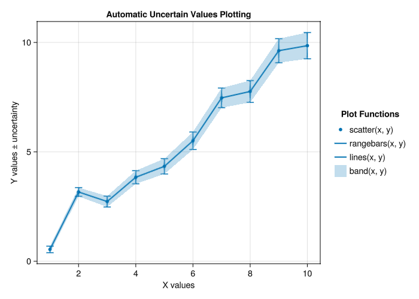

# Uncertain.jl 📊

> [!IMPORTANT]
> Handle uncertain values with ease and high performance! 🚀

A Julia package for representing and propagating uncertainties through calculations with minimal overhead. Designed with composability and speed in mind, applicable to large datasets of uncertain values.

## Key Features ✨

- **⚡ Minimal overhead**: Only 2x memory usage and ~3x computational overhead compared to regular values
- **🎯 Simple API**: Clean interface with the `±ᵤ` operator and `U` module
- **🔧 Flexible uncertainty types**: Support for symmetric, asymmetric, and custom uncertainty representations  
- **🌐 Rich ecosystem integration**: Works seamlessly with Makie, Unitful, and more

## Quick Start 🚀

The most common case is numbers with measurement errors. 📏 `Uncertain.jl` exports the `±ᵤ` operator and the `U` module:

```julia
using Uncertain

julia> x = 1 ±ᵤ 0.1  # Create an uncertain value
1.0 ± 0.1

julia> typeof(x)
Uncertain.ValueReal{Float64, Float64}

julia> U.value(x)     # Extract the nominal value
1.0

julia> U.uncertainty(x)  # Extract the uncertainty
0.1

julia> y = 2.5 ±ᵤ 0.2
2.5 ± 0.2

julia> x + y  # Automatic error propagation ✨
3.5 ± 0.22360679774997896
```

## Plotting 📊

`Uncertain.jl` provides Makie integration for visualizing uncertain values. You can pass uncertain values directly to plotting functions:

```julia
using Uncertain, GLMakie

# Create some data with uncertainties
x = 1:10
y = [i + 0.5*randn() ±ᵤ (0.1 + 0.05*i) for i in x]

# Plot with automatic uncertainty handling
scatter(x, y)
rangebars(x, y)
lines(x, y)
band(x, y)
```



The plotting functions `scatter()`, `rangebars()`, `lines()`, and `band()` (and others where it makes sense) work directly with uncertain values, automatically extracting the necessary components for visualization.

## Scope 🎯

The ultimate goal of `Uncertain.jl` is to support arbitrary uncertainty specifications – asymmetric errors, intervals, more complex distributions, and to go beyond plain numbers. All within a single uniform interface. 🌈

Currently, aside from plain numbers, `Uncertain` provides the `U.TwoSided(lo, hi)` objects to represent asymmetric two-sided uncertainties. The companion `UncertainSkyCoords.jl` package provides uncertainties specific to `SkyCoords.jl` objects – essentially, sky regions with different shapes. These types do not support _all_ operations where error propagation would make sense yet; reports and suggestions on specific missing operations are welcome!

Furthermore, `Uncertain.jl` provides integrations with other parts of the Julia ecosystem: 🔗
- 📊 Plotting with `Makie` – you can pass uncertain values to any recipe where it makes sense
- 🔄 Conversions to and from `IntervalSets.jl`, `Measurements.jl` and `MonteCarloMeasurements.jl` objects for ease of interoperability
- 📐 `Uncertain.Value`s with `Unitful.jl` quantities inside them support the `Unitful.jl` interface

## Why `±ᵤ` instead of `±`? 🤔

We use the `±ᵤ` operator (not just `±`) to avoid conflicts with the popular `IntervalSets.jl` package, which exports the `±` operator for creating intervals. This design choice ensures seamless compatibility when both packages are used together. 🤝

If you prefer to use the shorter `±` symbol, you can import it explicitly: ✨

```julia
using Uncertain
import Uncertain: ±ᵤ as ±

julia> x = 1.5 ± 0.05  # Now you can use the standard ± symbol
1.5 ± 0.05

julia> y = 3.2 ± 0.1
3.2 ± 0.1

julia> x * y  # Works exactly the same ⚡
4.8 ± 0.19209372712298546
```

## Relation to other uncertainty packages 📈

The fundamental design difference of `Uncertain.jl`, compared to other Julia packages in this field like `Measurements.jl` and `MonteCarloMeasurements.jl`, is low overhead. 🚄 It handles large datasets of values with uncertainties. They occupy only 2x more memory than regular values, and have a performance overhead of only a factor of a few.
```julia
julia> n = 10^6
julia> x = rand(n)
julia> xu = x .±ᵤ 0.1

julia> Base.summarysize(x)
8000040

julia> Base.summarysize(xu)
16000040

julia> @b x .+ 1
482.584 μs (4 allocs: 7.629 MiB)

julia> @b xu .+ 1
1.201 ms (4 allocs: 15.259 MiB)
```
Other packages tend to have orders-of-magnitude overhead: `Measurements.jl` because it handles linear correlations, and `MonteCarloMeasurements.jl` because it uses Monte Carlo samples to represent uncertainties. 📊

Those other packages have much higher performance overhead, but they certainly have advantages over `Uncertain.jl`. ⚖️ In particular, here we only handle operations on independent uncertain values. All functions that involve only one uncertain number like `exp(x::Uncertain.Value)` or `x::Uncertain.Value + y::Float64` are automatically correct as there are no dependencies possible. Computing multivariate functions like `x::Uncertain.Value + y::Uncertain.Value` correctly requires accounting for correlations in the general case; we do not do that here. We have a flag one can set to control whether to assume independent values, or fail on these operations: 🛠️
```julia
julia> Uncertain.assume_independent() = false

julia> x = 1 ±ᵤ 0.1
julia> y = 2 ±ᵤ 0.5

julia> x + y
ERROR: The `+` operation is only correct for independent `Uncertain.Value`s, and we have no way to prove the independence automatically.
Set `Uncertain.assume_independent() = true` to execute such functions.

julia> Uncertain.assume_independent() = true

julia> x + y
3.0 ± 0.5099019513592785
```

Naturally, the choice of which package to use differs in different scenarios. 🎯 `Uncertain.jl` values can easily be converted back and forth to corresponding objects of other packages, making interoperability more straightforward. 🔄
